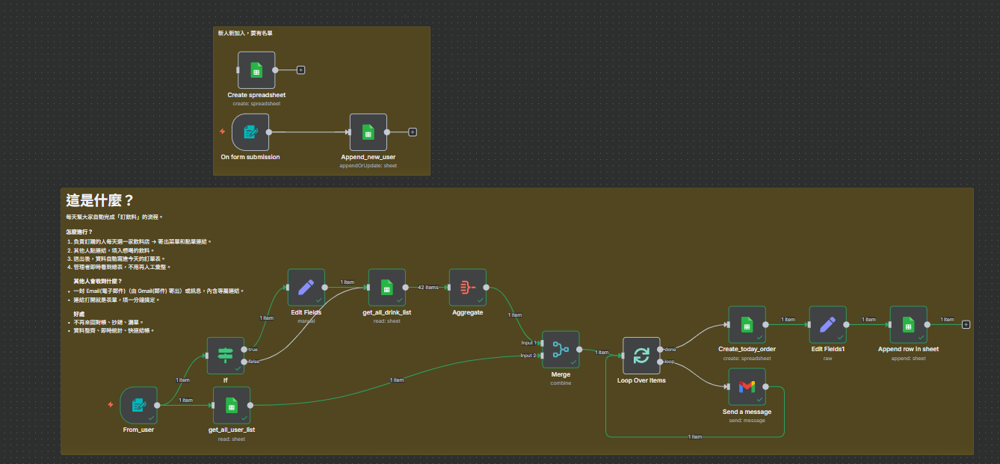

# **這是什麼？**  
每天幫大家自動完成「訂飲料」的流程。

**怎麼進行？**  
1) 負責訂購的人每天選一家飲料店 → 寄出菜單和點單連結。  
2) 其他人點連結，填入想喝的飲料。  
3) 送出後，資料自動寫進今天的訂單表。  
4) 管理者即時看到總表，不用再人工彙整。

**其他人會收到什麼？**  
- 一封 由 Gmail(郵件) 寄出 Email，內含菜單與表單連結。  
- 連結打開就是表單，填一分鐘搞定。

**好處**  
- 不再來回對帳、抄錯、漏單。  
- 資料整齊、即時統計、快速結帳。  

